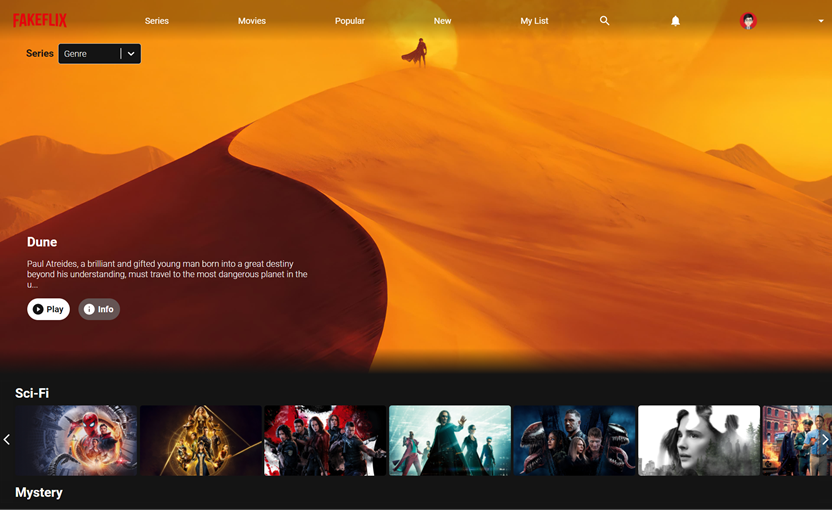

# Fakeflix

    Projet perso | Clone d'une Plateforme de streaming


<kbd></kbd>

> PROBLEMATIQUE

Reproduction de l'interface et de ses fonctionnalités

## Compétences développées

- [x] Reproduction d'une application et de ses fonctionnalités
- [x] Utilisation d'une base de données sur serveur distant
- [x] Sécurisation de la clé d'authentification à l'API
- [x] Optimisation des performances de chargement et de rendu

## Méthodologie

🔘 Analyse · Synthèse · Personnalisation
🔘 Environnement local sécurisé
🔘 Appels asynchrones de l'API REST tmdb
🔘 Mise en cache des données
🔘 Gestion des données : itération, filtre, tri, adaptation
🔘 Traitement différé des fonctionnalités selon besoin
🔘 Fragmentation du code (bundle splitting)
🔘 Gestion locale & globale des états
🔘 Rendus conditionnels selon interaction
🔘 Mémorisation des valeurs et états selon besoin
🔘 Génération aléatoire d'affichage

## Choix techniques

> VOIR TAGS DE LA DESCRIPTION DU DEPÔT

🔘 Gestionnaires d'Etat
    ✔ useState
    ✔ useContext
    ✔ useReducer

🔘 Mémorisation de valeurs
    ✔ useRef
    ✔ useMemo

🔘 Actualisation de rendu
    ✔ useEffect

🔘 Gestionnaires de navigation
    ✔ React Router
    ✔ Nested Routes
    ✔ useLocation
    ✔ useNavigation

🔘 Hooks personnalisés

🔘 Optimisation des performances
    ✔ Axios
    ✔ Cache data
    ✔ Local storage
    ✔ Lazy / Suspens

## Bibliothèque

    React-JS

## Installation

### Editeur recommandé

* [Visual Studio code](https://code.visualstudio.com/)

### Prérequis

* [Git](https://git-scm.com/) pour cloner les repos
* [nodeJS](https://nodejs.org/fr/) (version 17.8.0) pour exécuter les commandes
* [npm](https://docs.npmjs.com/downloading-and-installing-node-js-and-npm) (version 8.6.0) pour lancer l'application

### Dépendances

*  [react](https://fr.reactjs.org/docs/getting-started.html) (version 17.0.2)
*  [react-router-dom](https://reactrouter.com/web/guides/quick-start) (version 6.0.2)
*  [prop-types](https://fr.reactjs.org/docs/typechecking-with-proptypes.html) (version 15.8.0)
*   [axios] (https://axios-http.com/fr/docs/intro) (version 0.25.0)
*   [MUI] (https://mui.com/) (version 5.3.0)
*   [react-select] (https://react-select.com/home) (version 5.2.2)

### Lancement du front-end

- [ ] Cloner le repo : `git clone https://github.com/codexarama/WealthHealth.git`
- [ ] Aller dans ce dossier : `cd WealthHealth`
- [ ] Installer ses dépendances : `npm install`
- [ ] Lancer l'application : `npm start`

```bash
URL de visualisation du rendu web : http://localhost:3000
```
